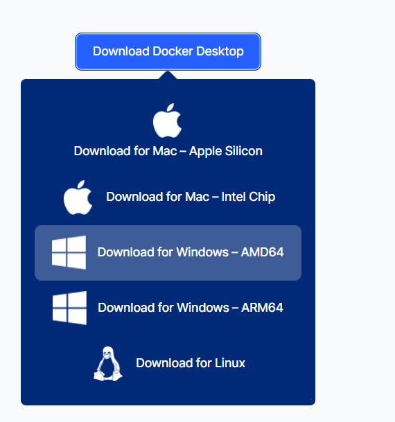
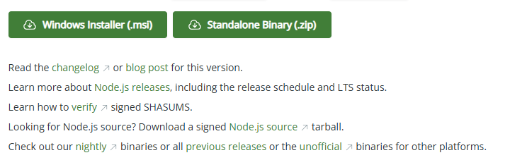
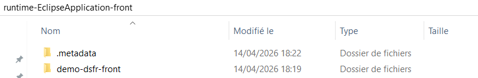
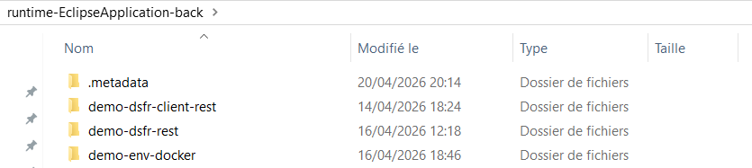
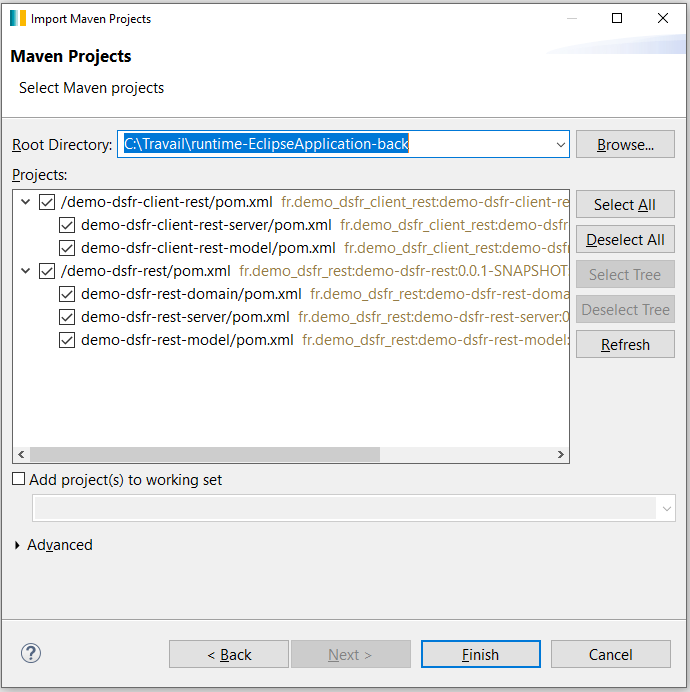
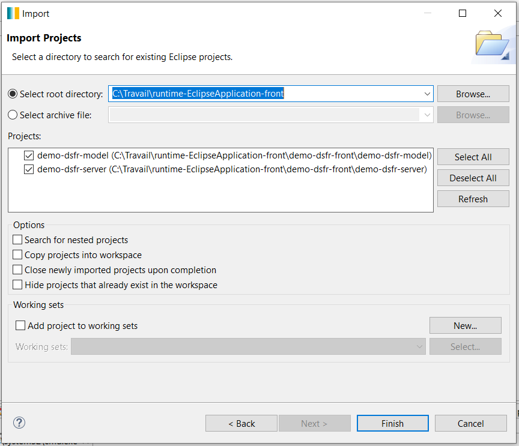
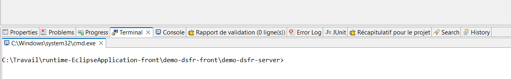

# 🛠️ Paramétrage de l'environnement de démonstration Pacman 

📅 Historique des mises à jour

- 09/04/2026 : Initialisation du document.
---

## 🚀 Introduction

Ce document présente les étapes nécessaires à l'installation et au paramétrage de l'environnement de démonstration des générateurs de code **Pacman**. Il a pour objectif de guider l'utilisateur dans la mise en place rapide et efficace des différents composants requis, afin de pouvoir exploiter pleinement les capacités de génération offertes par l'outil. Les instructions fournies couvrent à la fois la configuration initiale et les ajustements indispensables pour adapter la démonstration à un contexte de développement concret.

❗ Il n'est pas dans l'objectif de ce document de préciser les modalités d'installation des générateurs "**Pacman**", ces dernières sont censées être connues par le lecteur, et ce document ne concerne que l'installation et le paramétrage de l'application de démonstration.

Par ailleurs : 

- On suppose que git est déjà installé sur la machine cible. 
- On suppose que le studio est déjà installé sur la machine cible.
- Cette documentation est basée sur une installation pour un poste Windows uniquement. 
- La version du jdk Java doit être la version 17+.
- Avant de commencer la procédure il est conseillé de désactiver temporairement tous les antivirus qui pourraient bloquer la récupération des dépendances.

---

❗ Comme l'objectif même de **Pacman** est de générer des applications modélisées, il n'est pas livré de version exécutable de l'application de démonstration. Ce sont donc les sources qui sont récupérées et qui doivent être lancées dans un *runtime* afin de tester l'application et, éventuellement, de modifier la modélisation pour relancer les générations. 

❗ Dans cette application de démonstration, le fichier "*application.properties*" peut contenir des informations sensibles (comme des clés symétriques, des jetons ou d'autres paramètres de sécurité) volontairement exposées afin de simplifier la mise en place et les tests en environnement de développement. Ces valeurs sont fournies uniquement à des fins pédagogiques et pratiques, et ne respectent pas les exigences de sécurité attendues en production. Il est donc impératif de ne pas réutiliser ces configurations telles quelles dans un contexte réel : toute donnée sensible doit être externalisée, sécurisée (via des variables d'environnement, un gestionnaire de secrets, etc.) et correctement protégée avant tout déploiement en production.

# Installation Docker Desktop

La version de docker utilisée lors des tests est la version 4.69.0, mais à priori il ne devrait pas y avoir d'impact majeur à prendre la dernière version en cours. Aller sur le site : https://www.docker.com/products/docker-desktop/ et télécharger la dernière version du Docker Desktop. Choisir la version AMD 64. Une fois téléchargé lancer l'exécutable, l'installation ne pose aucune difficulté particulière.

<div align="center">
  
</div>

❗ L'option "Allow Windows Containers to be used with this installation" permet d’utiliser des conteneurs Windows natifs au lieu des conteneurs Linux. Ne pas cocher cette case et laisser par contre les options cochées par défaut (surtout l'utilisation de WSL).

# Installation Node.js 

La version utilisée pour l'écriture de ce document est la version 25.9.0. Vérifier si Node.js est déjà installé en ouvrant une invite de commande (bash) et en tapant la commande suivante (Si une version est affichée, Node est déjà installé): 

```bash
npm -v
```

Télécharger Node.js sur le site officiel : https://nodejs.org/en/download/current et préférer la version "Windows Installer (.msi)", c'est la méthode officielle recommandée par Node.js pour Windows.

<div align="center">
  
</div>

Lancer le téléchargement, cliquer sur l'éxécutable d'installation, laisser toutes les options par défaut et simplement se laisser guider par l'installateur. Répéter l'opération précédente pour vérifier la bonne prise en compte de l'installation. La commande doit maintenant renvoyer un numéro de version. Attention de ne pas confondre, le numéro de version renvoyé est celui de npm et non celui de Node.js.

# Récupération des sources de l'application

Créer un répertoire de travail afin de récupérer les sources de l'application de démonstration.
Se positionner au niveau du répertoire de travail et taper la commande suivante afin de récupérer l'ensemble des sources : 

```bash
git clone https://github.com/spi4j/pacman-demo.git
```

Suite à cette commande un répertoire "*pacman-demo*" a été créé avec à l'intérieur quatre sous-répertoires qui sont respectivement : 

- "***demo-dsfr-client-rest***" : la partie "*client*" de l'application React.
- "***demo-dsfr-front***" : la partie "*front*" de l'application en React.
- "***demo-dsfr-rest***" : la partie "*back*" de l'application en Spring Boot.
- "***demo-env-docker***" : la configuration Docker pour l'ensemble de la démonstration.

# Configuration de Docker Desktop

Il n'a pas de de configuration lourde pour récupérer et paramétrer l'ensemble de l'environnement nécessaire au bon fonctionnement de l'application de démonstration. Docker est chargé de faire fonctionner : 

- Un serveur SSO pour l'authentification (Keycloak).
- Un serveur S3 pour le stockage de fichiers (Minio).
- Un coffre-fort pour le stockage des paramètres sensibles de l'application (Vault).

Se positionner au niveau du répertoire "*demo-env-docker*", lancer Docker Desktop, ouvrir une ligne de commande et simplement lancer le script d'activation : 

```bash
startup-demo.bat
```
Ce script va charger l'ensemble des images nécessaires et paramétrer l'ensemble des serveurs. Il détecte automatiquement si Docker Desktop est lancé (et demande à le lancer manuellement si cela n'est pas déjà effectué). Une fois terminé, les différents serveurs sont alors prêts pour le fonctionnement de l'application. Comme indiqué dans la sortie du script les identifiants et mots de passe sont simplement "*admin*" et "*password*". Le script doit se terminer avec les lignes suivantes : 

```bash
=====================================
ENVIRONNEMENT PRET POUR LA DEMO
=====================================
```

Dans les différents messages qui sont affichés sur la console, bien récupérer le jeton Vault (**TOKEN VAULT**), il sera nécessaire de l'écrire au niveau du fichier "*application.properties*" du backend. Ce jeton change à chaque nouvelle installation de Vault.

```bash
=====================================
CONFIGURATION VAULT
=====================================
TOKEN VAULT = [XXXXXXXXXXXXXXXXXXXXXXXXXXX]
Activation du moteur KV (si necessaire)...
Activation KV...
Success! Enabled the kv-v2 secrets engine at: secret/
Injection des secrets S3 (MinIO)...
Configuration Vault terminee
```

Il est à noter que ce jeton peut aussi à tout momment être retrouvé au niveau du fichier "vault-init.txt" qui a été créé dans le répertoire "*demo-env-docker/vault*"

```bash
Unseal Key 1: XXXXXXXXXXXXXXXXXXXXXXXXXXXXXXXXXXXXXXXXXXXX
Unseal Key 2: XXXXXXXXXXXXXXXXXXXXXXXXXXXXXXXXXXXXXXXXXXXX
Unseal Key 3: XXXXXXXXXXXXXXXXXXXXXXXXXXXXXXXXXXXXXXXXXXXX
Unseal Key 4: XXXXXXXXXXXXXXXXXXXXXXXXXXXXXXXXXXXXXXXXXXXX
Unseal Key 5: XXXXXXXXXXXXXXXXXXXXXXXXXXXXXXXXXXXXXXXXXXXX

Initial Root Token: XXXXXXXXXXXXXXXXXXXXXXXXXXX
```

Il est possible de relancer ce script à tout moment pour une autre démonstration... ou simplement de relancer le Docker Desktop (dans ce cas bien vérifier que les conteneurs sont aussi démarrés). Pour arrêter proprement les conteneurs, il est aussi possible d'utiliser le second script livré à cet effet : "*stop-demo.bat*". Ce script permet : 

- de simplement stopper les conteneurs (option 1).
- de supprimer complètement les différents conteneurs et leur configuration associée (option 2) . 

```bash
=====================================
ARRET DE L\'ENVIRONNEMENT DEMO
=====================================

Choisissez un mode :
1 - Arret simple (conserver les donnees)
2 - RESET COMPLET (SUPPRIME TOUT)

Entrez votre choix (1 ou 2) :
```

# Installation de l'application (sources)

Dans la version "*source*", il est nécessaire d'avoir deux instances du studio avec pour chacune, les sources de "**Pacman**" ("*pacman-front*" pour le front et "*pacman-back*" pour le backend). Les sources de **Pacman** sont disponibles ici (git clone) :

- Pacman Front :  https://github.com/spi4j/pacman-front.git
- Pacman Back : https://github.com/spi4j/pacman-back.git

- Créer un répertoire de travail pour le runtime du back (par exemple : "*runtime-EclipseApplication-back*")
- Créer un répertoire de travail pour le runtime du front (par exemple : "*runtime-EclipseApplication-front*")
- Copier le répertoire "pacman-dsfr-front" dans le répertoire du runtime du front.
- Copier les autres répertoires dans le répertoire du runtime du back.

A ce stade l'arborescence devrait ressembler à ceci : 

<div align="center">
  
</div>

<div align="center">
  
</div>

Au niveau du "*back*" importer les deux projets "*demo-dsfr-client-rest*" et "*demo-dsfr-rest*" ("*Import Maven Projects*")

<div align="center">
  
</div>

Ouvrir le project "*demo-dsfr-rest*" et se positionner au niveau du fichier de configuration "*/src/main/resources/application.properties*". On peut remarquer que dans le cadre de l'application de démonstration ce jeton est automatiquement récupéré dans une variable d'environnement. Cette variable est positionnée par le script "*start-demo.bat*" qui a été lancé précédemment pour la configuration des conteneurs Docker Desktop.

```properties
...
# Méthode d'authentification <token|approle|userpass|etc...>
spring.cloud.vault.authentication=token
# Le token d'accès Vault (à ne pas utiliser en production (dev ou demo uniquement) !)
spring.cloud.vault.token=${PACMAN_DEMO_VAULT_TOKEN}
...
```
Renseigner la clé "*security.jwt.secret*" avec la valeur donnée ci-dessous : 

```properties
security.jwt.secret=HhO7b9aZ0e6eXEkQcL4BFxkGXGcWyN7F
```

Il est maintenant possible de démarrer le backend en se positionnant au niveau du package : "*fr.demo\_dsfr\_rest*" et en activant le menu contextuel "*/Run As / 1 Java Application*" sur la classe "*Demo_dsfr_restBootstrap*". Il est normal de voir passer dans la console cet affichage car l'application charge la base de données avec des valeurs aléatoires : 

```bash
2026-04-14 13:15:42 - org.hibernate.SQL - select next value for USERDEMO_SEQ
2026-04-14 13:15:42 - org.hibernate.SQL - insert into USERDEMO (ADDRESS,BUSINESSACTIVITY,CITY,CIVILITY,DATEOFBIRTH,FIRSTNAME,LASTNAME,LOGIN,MAIL,PASSWORD,PHONE,ZIPCODE,USERDEMO_ID) values (?,?,?,?,?,?,?,?,?,?,?,?,?)
2026-04-14 13:15:42 - org.hibernate.orm.jdbc.bind - binding parameter (1:VARCHAR) <- [467 Avenue Saint-Denis]
2026-04-14 13:15:42 - org.hibernate.orm.jdbc.bind - binding parameter (2:VARCHAR) <- [Hospital & Health Care]
2026-04-14 13:15:42 - org.hibernate.orm.jdbc.bind - binding parameter (3:VARCHAR) <- [Villejuif]
2026-04-14 13:15:42 - org.hibernate.orm.jdbc.bind - binding parameter (4:VARCHAR) <- [Dr]
2026-04-14 13:15:42 - org.hibernate.orm.jdbc.bind - binding parameter (5:DATE) <- [2026-06-09]
2026-04-14 13:15:42 - org.hibernate.orm.jdbc.bind - binding parameter (6:VARCHAR) <- [Mathéo]
2026-04-14 13:15:42 - org.hibernate.orm.jdbc.bind - binding parameter (7:VARCHAR) <- [Lacroix]
2026-04-14 13:15:42 - org.hibernate.orm.jdbc.bind - binding parameter (8:VARCHAR) <- [mathéo.lacroix]
2026-04-14 13:15:42 - org.hibernate.orm.jdbc.bind - binding parameter (9:VARCHAR) <- [matheo.lacroix@yahoo.fr]
2026-04-14 13:15:42 - org.hibernate.orm.jdbc.bind - binding parameter (10:VARCHAR) <- [n9es5c631883r77t]
2026-04-14 13:15:42 - org.hibernate.orm.jdbc.bind - binding parameter (11:VARCHAR) <- [04 11 03 70 20]
2026-04-14 13:15:42 - org.hibernate.orm.jdbc.bind - binding parameter (12:VARCHAR) <- [62561]
2026-04-14 13:15:42 - org.hibernate.orm.jdbc.bind - binding parameter (13:BIGINT) <- [1]
```

La console doit se terminer avec un affichage de ce type et le serveur est alors en écoute sur le port 8081 (pour les services rest) et 8080 pour les apis de santé : 

```bash
2026-04-14 13:15:45 - o.s.b.w.e.tomcat.TomcatWebServer - Tomcat started on port 8080 (http) with context path '/'
2026-04-14 13:15:45 - f.d.Demo_dsfr_restBootstrap - Started Demo_dsfr_restBootstrap in 9.161 seconds (process running for 9.678)
```

Au niveau du "*front*" importer le projet "demo" (❗ Attention, cette fois avec "*Existing Projects into Workspace*" )

<div align="center">
  
</div>

Il est conseillé de créer un nouveau projet "**Pacman**" à l'aide du wizard de création (voir si besoin la documentation de "**Pacman-front**"), ceci juste pour avoir rapidement l'ensemble des onglets disponibles (Terminal, etc...)/

- Ouvrir le terminal (Dans Eclipse) et se positionner au niveau du projet "*demo-dsfr-server*" :

<div align="center">
  
</div>

- Taper la commande suivante afin de reconstituer l'ensemble des dépendances (répertoire "*node_modules*")

```bash
npm ci
```

- Enfin taper la commande suivante pour lancer le serveur en frontal : 

```bash
npm run dev
```

L'application est maintenant accessible à l'url suivante : http://localhost:5173


# Installation de l'application (binaires)

Récupérer la dernière release au niveau de git (https://github.com/spi4j/pacman-demo). A l'heure de l'écriture de ce document la dernière version en date est la version 1.0.2. 

Trois fichiers doivent être récupérés : 

- demo-dsfr-rest-back-1.0.2.jar : le fichier pour le backend.
- demo-dsfr-rest-front-1.0.2.zip : le fichier pour le frontend.
- demo-env-docker-1.0.2.zip : les fichiers de paramétrage pour les serveurs externes.


Copier les trois fichiers dans un répertoire.

Dézipper le fichier "*demo-env-docker-1.0.2.zip*", lancer Docker Desktop ainsi que le script d'installation et de paramétrage avec la commande suivante : 

```bash
start-demo.bat
```

Lancer simplement le backend avec la commande suivante : 

```bash
java -jar demo-dsfr-rest-back-1.0.2.jar
```

Dézipper le fichier "*demo-dsfr-rest-front-1.0.2.zip*" dans un répertoire (ex : "*demo-dsfr-rest-front-1.0.2*"), se positionner au niveau de ce répertoire et lancer la commande suivante : 

```bash
npx serve -s . -l 5173
```
Se connecter sur l'url suivante : http://localhost:5173

# Astuces et conseils

Ne pas hésiter si besoin à vider le cache de Vite à l'aide de la commande suivante au niveau du terminal : 

```bash
rmdir /s /q node_modules\.vite
```


